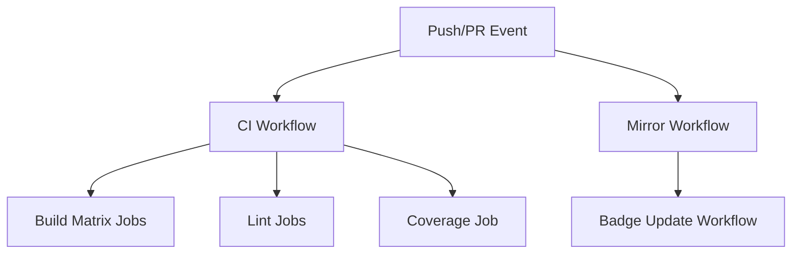

# Design Document

## Overview

This design consolidates the current 5 GitHub Actions workflows into 3 optimized workflows that eliminate redundancy, improve performance, and follow current best practices. The consolidation focuses on creating reusable components, standardizing OpenCV setup, and maintaining all existing functionality while improving maintainability.

## Architecture

### Workflow Structure

```
.github/workflows/
├── ci.yml                    # Main CI/CD pipeline (consolidates build.yml, lint.yml, lint-soft.yml)
├── mirror-gitlab.yml         # GitLab mirroring (updated from mirror-to-gitlab.yml)  
└── update-badges.yml         # Badge updates (updated from update-readme-badge.yml)
```

### Workflow Dependencies



## Components and Interfaces

### 1. Main CI Workflow (`ci.yml`)

**Purpose:** Unified build, test, lint, and coverage pipeline

**Triggers:**
- Push to any branch
- Pull request events
- Manual dispatch

**Matrix Strategy:**
```yaml
strategy:
  matrix:
    go-version: [1.22, 1.23]
    os: [ubuntu-latest, macos-latest]
    include:
      - os: ubuntu-latest
        coverage: true  # Only run coverage on one matrix job
```

**Jobs:**
1. **build-and-test** - Matrix job for building and testing
2. **lint-strict** - Strict linting (fails on issues)
3. **lint-soft** - Soft linting (informational only, runs on PRs)

### 2. Reusable OpenCV Setup Action

**Composite Action:** `.github/actions/setup-opencv/action.yml`

**Inputs:**
- `os`: Operating system (ubuntu-latest, macos-latest)

**Outputs:**
- `cgo-cflags`: CGO compiler flags
- `cgo-ldflags`: CGO linker flags
- `pkg-config-path`: PKG_CONFIG_PATH value

**Implementation:**
- Detects OS and installs appropriate OpenCV packages
- Sets up pkg-config paths consistently
- Exports environment variables for subsequent steps

### 3. GitLab Mirror Workflow

**Purpose:** Maintains GitLab repository mirror

**Improvements:**
- Updated to use actions/checkout@v4
- Better error handling and logging
- Conditional execution based on repository settings

### 4. Badge Update Workflow

**Purpose:** Updates README badges after successful mirroring

**Improvements:**
- More robust badge detection and insertion
- Better error handling for missing secrets
- Conditional execution

## Data Models

### Environment Variables Schema

```yaml
# Standard across all workflows
CGO_ENABLED: "1"
GO111MODULE: "on"

# Set by OpenCV setup action
CGO_CFLAGS: "$(pkg-config --cflags opencv4)"
CGO_LDFLAGS: "$(pkg-config --libs opencv4)"
PKG_CONFIG_PATH: "/usr/lib/pkgconfig:/usr/lib/x86_64-linux-gnu/pkgconfig"
```

### Workflow Configuration Schema

```yaml
# Caching strategy
cache-paths:
  - ~/.cache/go-build
  - ~/go/pkg/mod
  - ~/.cache/golangci-lint

# Artifact retention
artifacts:
  coverage-report:
    retention-days: 30
    paths: ["coverage.out", "coverage.html"]
```

## Error Handling

### OpenCV Installation Failures
- Fallback to manual library installation
- Clear error messages with troubleshooting steps
- Graceful degradation for non-critical features

### Build Matrix Failures
- Fail-fast: false to allow other matrix jobs to complete
- Individual job status reporting
- Consolidated failure summary

### Linting Failures
- Strict lint: Fails the workflow
- Soft lint: Reports issues but doesn't fail
- Clear differentiation in job names and outputs

## Testing Strategy

### Workflow Validation
1. **Syntax Validation:** Use `actionlint` to validate workflow syntax
2. **Local Testing:** Use `act` to test workflows locally before deployment
3. **Staged Rollout:** Test on feature branch before merging to main

### Matrix Testing Coverage
- Test all Go version and OS combinations
- Verify OpenCV setup works on all platforms
- Ensure coverage reporting works correctly

### Integration Testing
- Verify GitLab mirroring functionality
- Test badge update mechanism
- Validate artifact uploads and downloads

## Performance Optimizations

### Caching Strategy
```yaml
# Go modules cache
- uses: actions/cache@v4
  with:
    path: |
      ~/.cache/go-build
      ~/go/pkg/mod
    key: ${{ runner.os }}-go-${{ hashFiles('**/go.sum') }}

# golangci-lint cache
- uses: actions/cache@v4
  with:
    path: ~/.cache/golangci-lint
    key: ${{ runner.os }}-golangci-lint-${{ hashFiles('go.sum') }}
```

### Parallel Execution
- Run linting jobs in parallel with build matrix
- Use job dependencies only where necessary
- Minimize workflow execution time

### Resource Optimization
- Use appropriate runner sizes
- Optimize OpenCV installation steps
- Minimize artifact sizes

## Security Considerations

### Permissions
```yaml
permissions:
  contents: read
  pull-requests: read  # Only for lint jobs that need PR context
```

### Secret Management
- Use repository secrets for GitLab credentials
- Implement proper secret validation
- Fail gracefully when secrets are missing

### Dependency Security
- Pin action versions to specific commits
- Use dependabot for action updates
- Validate checksums where possible

## Migration Strategy

### Phase 1: Create New Workflows
1. Create consolidated `ci.yml` workflow
2. Create reusable OpenCV setup action
3. Test new workflows on feature branch

### Phase 2: Update Existing Workflows
1. Update mirror and badge workflows
2. Maintain backward compatibility during transition
3. Monitor workflow performance

### Phase 3: Cleanup
1. Remove old workflow files
2. Update documentation
3. Verify all functionality is preserved
