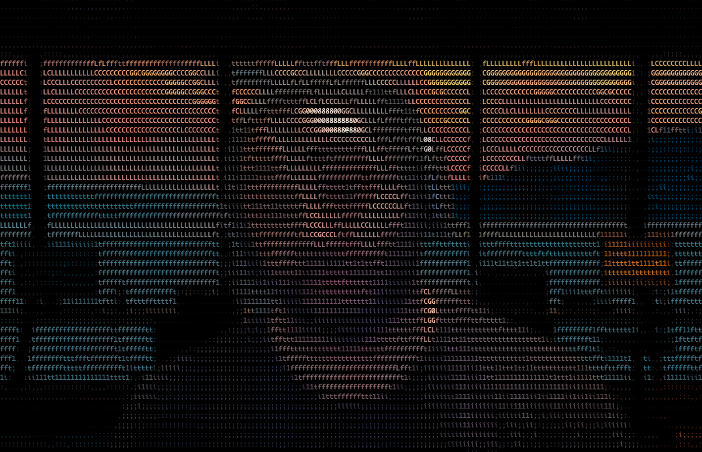

# 🖼️ asciicam

[](https://github.com/daryllundy/asciicam) 
[](https://gitlab.com/daryllundy/asciicam)
[](https://golang.org/)
[](LICENSE)
[](https://github.com/daryllundy/asciicam/actions)
[](https://codecov.io/gh/daryllundy/asciicam)
[](https://goreportcard.com/report/github.com/daryllundy/asciicam)

Transform your webcam feed into ASCII art directly in your terminal! asciicam provides real-time conversion of video input to ASCII characters or ANSI color blocks, complete with virtual greenscreen functionality.

## ✨ Features

- **🎥 Real-time ASCII conversion** - Live webcam to ASCII art
- **🎨 ANSI color mode** - High-resolution color blocks using ANSI escape codes
- **🟢 Virtual greenscreen** - Background removal with sample-based detection
- **🎯 Zoom control** - 25%, 50%, 75%, or 100% zoom levels
- **🌈 Color options** - Monochrome output with custom colors
- **📏 Auto-sizing** - Automatically detects terminal dimensions
- **⚡ Performance monitoring** - Built-in FPS counter
- **🔧 Configurable** - Extensive command-line options

## 🖼️ Screenshots

### ANSI Mode


### ASCII Mode  


## 📋 Table of Contents

- [Requirements](#-requirements)
- [Installation](#-installation)
- [Quick Start](#-quick-start)
- [Usage](#-usage)
- [Configuration](#-configuration)
- [Examples](#-examples)
- [Troubleshooting](#-troubleshooting)
- [Contributing](#-contributing)
- [License](#-license)

## 📦 Requirements

### System Requirements
- **Go**: 1.22 or newer
- **OpenCV**: 4.x (for webcam support)
- **pkg-config**: For OpenCV detection
- **Webcam**: Any USB or built-in camera
- **Terminal**: Modern terminal with ANSI support (recommended)

### Supported Platforms
- ✅ **macOS** (Intel and Apple Silicon)
- ✅ **Linux** (x86_64, ARM64)
- ⚠️ **Windows** (experimental support)

### Performance Notes
- **Minimum**: 2GB RAM, dual-core CPU
- **Recommended**: 4GB RAM, quad-core CPU for smooth performance
- Higher resolutions require more processing power

## 🛠️ Installation

### Option 1: Using Make (Recommended)

```bash
# Clone the repository
git clone https://github.com/daryllundy/asciicam.git
cd asciicam

# Install dependencies (macOS/Linux)
make deps
make check-deps

# Build the application
make build
```

### Option 2: Manual Installation

#### macOS
```bash
# Install OpenCV
brew install opencv

# Verify installation
pkg-config --cflags --libs opencv4

# Build asciicam
go build -o asciicam ./cmd/asciicam
```

#### Ubuntu/Debian
```bash
# Install OpenCV
sudo apt-get update
sudo apt-get install -y libopencv-dev pkg-config

# Verify installation
pkg-config --cflags --libs opencv4

# Build asciicam
go build -o asciicam ./cmd/asciicam
```

#### CentOS/RHEL/Fedora
```bash
# CentOS/RHEL
sudo yum install -y opencv-devel pkgconfig

# Fedora
sudo dnf install -y opencv-devel pkgconfig

# Build asciicam
go build -o asciicam ./cmd/asciicam
```

#### Arch Linux
```bash
# Install OpenCV
sudo pacman -S opencv pkgconf

# Build asciicam
go build -o asciicam ./cmd/asciicam
```

### Option 3: Using Installation Script
```bash
# Automatic dependency installation
./scripts/install-deps.sh

# Build application
./scripts/build.sh
```

## 🚀 Quick Start

```bash
# Basic ASCII output
./asciicam

# ANSI color blocks (recommended)
./asciicam -ansi=true

# Show FPS counter
./asciicam -ansi=true -fps=true

# Custom zoom level (50%)
./asciicam -ansi=true -zoom=2
```

## 📖 Usage

### Basic Usage
```bash
asciicam [OPTIONS]
```

### Command Line Options

| Flag | Description | Default | Example |
|------|-------------|---------|---------|
| `-dev` | Camera device ID | `0` | `-dev=1` |
| `-width` | Output width (characters) | Auto-detect | `-width=80` |
| `-height` | Output height (characters) | Auto-detect | `-height=24` |
| `-camWidth` | Camera input width | `1920` | `-camWidth=640` |
| `-camHeight` | Camera input height | `1080` | `-camHeight=480` |
| `-zoom` | Zoom level (1-4) | `4` (100%) | `-zoom=2` (50%) |
| `-ansi` | Use ANSI color blocks | `false` | `-ansi=true` |
| `-color` | Monochrome color (hex) | None | `-color="#00ff00"` |
| `-fps` | Show FPS counter | `false` | `-fps=true` |
| `-gen` | Generate background samples | `false` | `-gen=true` |
| `-greenscreen` | Enable virtual greenscreen | `false` | `-greenscreen=true` |
| `-sample` | Background sample directory | `bgsample` | `-sample=bgdata` |
| `-threshold` | Greenscreen threshold | `0.13` | `-threshold=0.12` |

### Zoom Levels
- `1` = 25% zoom
- `2` = 50% zoom  
- `3` = 75% zoom
- `4` = 100% zoom (default)

## ⚙️ Configuration

### Terminal Setup
For best results, use a terminal with:
- ANSI color support
- Monospace font
- Dark theme (for better contrast)
- Sufficient size (80x24 minimum)

### Camera Selection
```bash
# List available cameras (if multiple)
# Camera 0 is usually the default/built-in camera
./asciicam -dev=0  # Built-in camera
./asciicam -dev=1  # External USB camera
```

### Performance Tuning
```bash
# Reduce camera resolution for better performance
./asciicam -camWidth=640 -camHeight=480

# Smaller output size for lower-end systems
./asciicam -width=40 -height=20

# Monitor performance
./asciicam -fps=true
```

## 💡 Examples

### Example Scripts
Pre-configured examples are available in the `examples/` directory:

```bash
# Basic ASCII art
./examples/basic.sh

# ANSI color output
./examples/ansi-color.sh

# Greenscreen effect
./examples/greenscreen.sh

# Monochrome output
./examples/monochrome.sh
```

### Virtual Greenscreen Setup

1. **Generate background samples** (step out of camera view):
   ```bash
   ./asciicam -gen=true -sample=bgdata
   ```

2. **Use greenscreen effect** (step back into view):
   ```bash
   ./asciicam -greenscreen=true -sample=bgdata -ansi=true
   ```

3. **Fine-tune sensitivity**:
   ```bash
   ./asciicam -greenscreen=true -threshold=0.08 -sample=bgdata
   ```

### Creative Usage
```bash
# Matrix-style green output
./asciicam -color="#00ff00" -fps=true

# High contrast black and white
./asciicam -color="#ffffff"

# Terminal recording for demos
./asciicam -ansi=true -width=80 -height=24
```

## 🔧 Troubleshooting

### Common Issues

#### Build Errors

**Problem**: `pkg-config: command not found`
```bash
# macOS
brew install pkg-config

# Ubuntu/Debian
sudo apt-get install pkg-config

# CentOS/RHEL
sudo yum install pkgconfig
```

**Problem**: `Package opencv4 was not found`
```bash
# Verify OpenCV installation
pkg-config --list-all | grep opencv

# If not found, reinstall OpenCV
# macOS: brew reinstall opencv
# Linux: sudo apt-get install --reinstall libopencv-dev
```

**Problem**: Build fails with CGO errors
```bash
# Set CGO environment
export CGO_ENABLED=1

# Verify pkg-config path
export PKG_CONFIG_PATH="/usr/local/lib/pkgconfig:$PKG_CONFIG_PATH"
```

#### Runtime Issues

**Problem**: `Error opening video capture device`
```bash
# Check camera permissions (macOS)
# System Preferences > Security & Privacy > Camera

# List video devices (Linux)
ls /dev/video*

# Try different device ID
./asciicam -dev=1
```

**Problem**: Poor performance/low FPS
```bash
# Reduce camera resolution
./asciicam -camWidth=640 -camHeight=480

# Reduce output size
./asciicam -width=60 -height=20

# Use ASCII mode instead of ANSI
./asciicam (without -ansi=true)
```

**Problem**: Terminal display issues
```bash
# Clear terminal and try again
clear && ./asciicam

# Check terminal size
echo $COLUMNS $LINES

# Force specific dimensions
./asciicam -width=80 -height=24
```

#### Greenscreen Issues

**Problem**: Background not properly removed
```bash
# Adjust threshold (lower = more sensitive)
./asciicam -greenscreen=true -threshold=0.08

# Regenerate background samples
./asciicam -gen=true -sample=bgdata

# Ensure good lighting conditions
```

### System-Specific Notes

#### macOS
- May require camera permissions in System Preferences
- Built-in cameras usually work better than USB cameras
- Apple Silicon Macs: ensure OpenCV supports ARM64

#### Linux
- May need to be in `video` group: `sudo usermod -a -G video $USER`
- Check camera permissions: `ls -l /dev/video*`
- Some distributions require additional packages

#### Windows (Experimental)
- Requires MinGW-w64 for CGO compilation
- OpenCV installation more complex
- Limited testing - feedback welcome

### Getting Help

1. **Check existing issues**: [GitHub Issues](https://github.com/daryllundy/asciicam/issues)
2. **Create detailed bug report** with:
   - Operating system and version
   - Go version (`go version`)
   - OpenCV version (`pkg-config --modversion opencv4`)
   - Complete error output
   - Steps to reproduce

## 🏗️ Development

### Building from Source
```bash
# Clone repository
git clone https://github.com/daryllundy/asciicam.git
cd asciicam

# Install dependencies
make deps

# Run tests
make test

# Build application
make build

# Cross-compile for multiple platforms
make cross-build
```

### Project Structure
```
asciicam/
├── cmd/asciicam/          # Main application
├── internal/
│   ├── ascii/             # ASCII conversion logic
│   ├── camera/            # Camera handling
│   ├── config/            # Configuration management
│   └── greenscreen/       # Greenscreen functionality
├── docs/                  # Documentation and screenshots
├── examples/              # Usage examples
├── scripts/               # Build and deployment scripts
├── Makefile               # Build automation
└── README.md              # This file
```

### Available Make Targets
```bash
make help                  # Show all available targets
make build                 # Build the application
make test                  # Run tests
make lint                  # Run linter
make fmt                   # Format code
make clean                 # Clean build artifacts
make install               # Install to /usr/local/bin
```

## 🤝 Contributing

We welcome contributions! Please see [CONTRIBUTING.md](CONTRIBUTING.md) for guidelines.

### Quick Contributing Steps
1. Fork the repository
2. Create a feature branch
3. Make your changes
4. Add tests if applicable
5. Run `make check` to verify
6. Submit a pull request

### Areas for Contribution
- 🐛 Bug fixes
- 📚 Documentation improvements
- ✨ New features
- 🧪 Test coverage
- 🚀 Performance optimizations

## 📄 License

This project is licensed under the MIT License - see the [LICENSE](LICENSE) file for details.

## 🙏 Acknowledgments

- Built with [gocv](https://gocv.io/) for OpenCV bindings
- Uses [termenv](https://github.com/muesli/termenv) for terminal capabilities
- Inspired by ASCII art and terminal creativity

## 📞 Support

- **Documentation**: [README.md](README.md) and [docs/](docs/)
- **Issues**: [GitHub Issues](https://github.com/daryllundy/asciicam/issues)
- **Discussions**: [GitHub Discussions](https://github.com/daryllundy/asciicam/discussions)

---

**Made with ❤️ for the terminal art community**